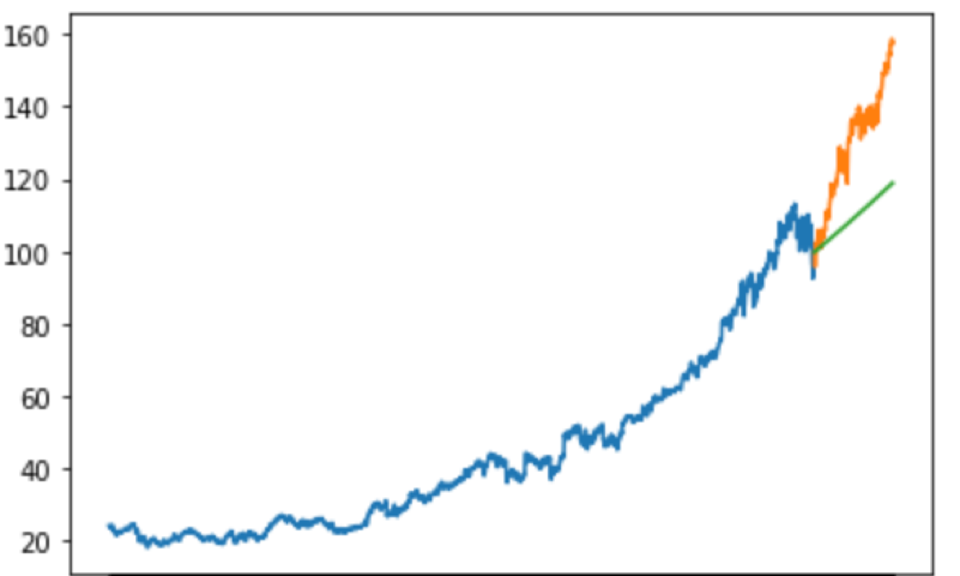
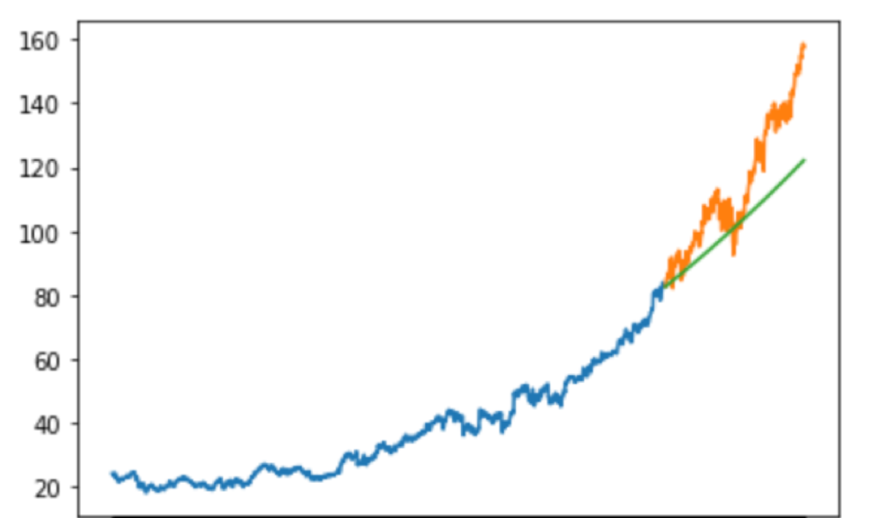

# Stock Analyzer/Predictor
### Purpose
The purpose of this project is to analyze historic stock price information and utilize machine learning models to predict those prices moving forward as best as possible.
### Data
The Data was retrieved from Yahoo! and contains the stock prices of all S&P 500 stocks from 1/1/2010 through 12/31/2019. To construct and tune the models univariate data was used, in this case the prices of Microsoft. The models can be fit and used on any of the stocks however.
### Models
- ARIMA
- FB Prophet
- Long Short Term Memory (LSTM)
### Results
# ARIMA 
ARIMA did not work especially well for forecasting stock price in this case. There were two main reasons for this
1. ARIMA is a linear model. One can only be so accurate prediciting a trend with oscillations and noise like a stock price with a straight line.
2. Shocks, either positive or negative, are very hard to account for. Microsoft had an incredible 2019, mostly attributed to the company's invesment into cloud computing. The stock roce 55% which was unprecedented in the data the model was trained on.
RMSE: 22.50

Interestingy enough the model performed better on a two year prediction than it did on a one year prediction. This is due to the accuracy for 2018. At the end of the year the prediction was only about a dollar and 30 cents off.
RMSE: 15.44

# FB Prophet

# LSTM

### Moving Forward
