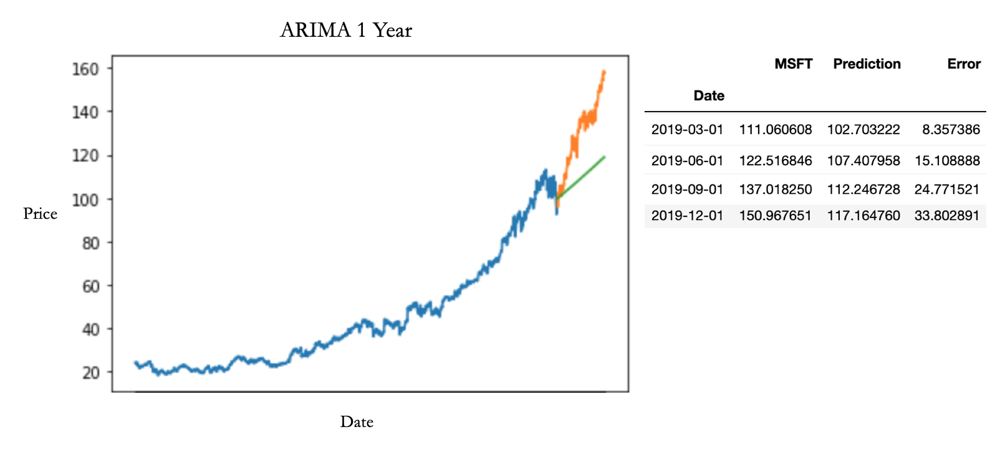
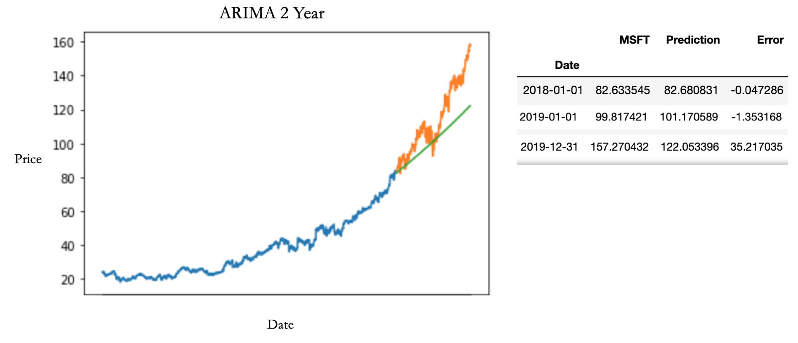
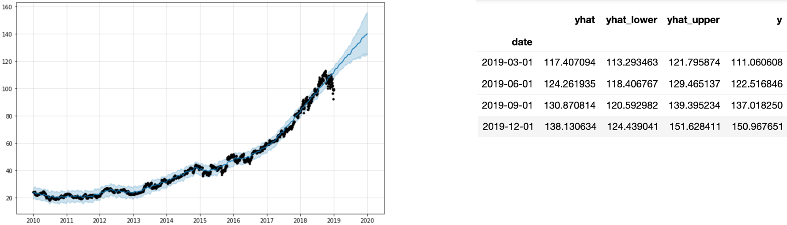
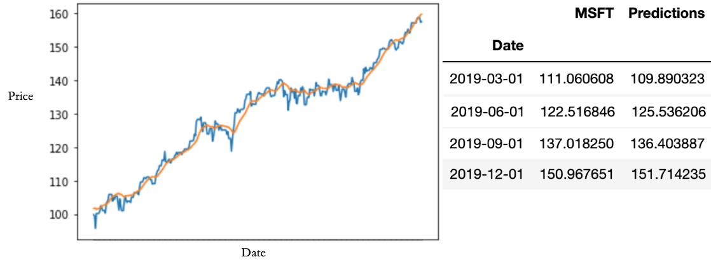

# Stock Analyzer/Predictor
## Purpose
The purpose of this project is to analyze historic stock price information and utilize machine learning models to predict those prices moving forward as best as possible.
## Data
The Data was retrieved from Yahoo! and contains the stock prices of all S&P 500 stocks from 1/1/2010 through 12/31/2019. To construct and tune the models univariate data was used, in this case the prices of Microsoft. The models can be fit and used on any of the stocks however.
## Models
- ARIMA
- FB Prophet
- Long Short Term Memory (LSTM)
## Results
### ARIMA 
ARIMA did not work especially well for forecasting stock price in this case. There were two main reasons for this
1. ARIMA is a linear model. One can only be so accurate prediciting a trend with oscillations and noise like a stock price with a straight line.
2. Shocks, either positive or negative, are very hard to account for. Microsoft had an incredible 2019, mostly attributed to the company's invesment into cloud computing. The stock roce 55% which was unprecedented in the data the model was trained on. 
<!-- end of the list -->
RMSE: 22.50

Interestingy enough the model performed better on a two year prediction than it did on a one year prediction. This is due to the accuracy for 2018. At the end of the year the prediction was only about a dollar and 30 cents off.  
RMSE: 15.44

### FB Prophet
FB Prophet is a model based on a generalized additive model (GAM). 
The model was fairly effective at forecasting forward and was extremely fast making it's predictions. For these reasons I chose to use this model for the front end of the project.  
RMSE: 8.36

### LSTM
LSTM is an evolution of a Recurrent Neural Network.  
LSTM uses a feedback loop and gates to “remember”. It predicts one step forward then shifts its window and updates its memory. 
LSTM was the most effective model at forecasting stock prices but takes about an hour to fit.  
MSE: 4.1 (RMSE: ~ 2)

## Moving Forward
Using these models you can make a reasonable prediction moving forward but they don't take into account many factors that affect stock prices. To deal with this I would like to add two more pieces to this project:
1. Sentiment Analysis: a model that can pick up on trends and news in the market that may cause shocks. NLP would be used for this.
2. Fundamental Analysis: a model or decision machine that compiles financial statement information, computes critical metrics and ratios and runs the company through a "filter function" that categorizes it as a "Buy, "Sell", or "Hold.
<!-- end of the list -->
Using all three of these pieces in tandem would give you a much better overall view of a company and it's stock and would allow you to make a confident prediction about it's price into the future.
